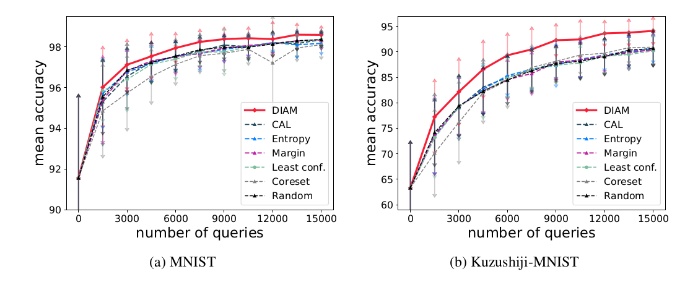

## Active Learning for Multiple Target Models

Authors: Ying-Peng Tang and Sheng-Jun Huang

Official implementation of the paper "Active Learning for Multiple Target Models". This work tries to select and label the most useful examples that are beneficial to multiple target models. The repository include the code of training/testing models, active data selection of all compared methods, plot and generate the figures and tables in the paper.

## Main requirements

This project is based on [once-for-all](https://github.com/mit-han-lab/once-for-all/) project for the model training and testing, please follow the [instructions](https://github.com/mit-han-lab/once-for-all/) to install the preliminary requirements.

Additional requirements:

- alipy
- scikit-learn
- tqdm

## Computational Resources

We run our experiments on 3 cloud servers, each of them has 128GB memory and 4 RTX 2080 graphic cards. The CPU is Intel Xeon Silver 4110 @ 2.10GHz with 8 cores. Since we run each of the compared method on one graphic card, respectively, we report the resource occupation of each individual process. The minimum requirement to train and validate the model is 10GB memory and 11GB CUDA memory with 128 batch size, respectively. If running the coreset query method, 10GB extra memory is needed to store the distance matrix. 

## Pre-trained models

The target models are taken from a recent NAS work [once-for-all](https://github.com/mit-han-lab/once-for-all/). The model specifications can be found at load_test_models.py. Running the code will automatically download and apply the pre-trained weights provided by [once-for-all](https://github.com/mit-han-lab/once-for-all/).

## Usage

##### Script to Run the Entire Experiments

We provide the `iter_all.sh`  script to run the active learning iterations, which include the training/testing, active selection functions. Invoke the script by the following:

```
# usage: bash iter_all.sh [gpu_id] [number_of_target_models]
bash iter_all.sh 0 12
bash iter_all.sh 1 8
bash iter_all.sh 2 4
......
```

Next, we present the usage of each individual function.

##### Training Model

```
# usage: python train_net.py --net_id [int: 0, 1, 2, ..., 11] --dataset ['mnist', 'kmnist'] --al_iter [int: 0, 1, 2, ..., 10] --method = ["margin", "entropy", "least_conf", "coreset", "random", "CAL", "DIAM"]
python train_net.py --net_id 0 --dataset mnist --al_iter 0 --method entropy
```

##### Active Query

```
# usage: python al_select.py --method [$METHOD] --dataset [$DATASET] --al_iter [int: 0, 1, 2, ..., 10] --batch_size [active query batch size] --model_num [number_of_target_models]
python al_select.py --method entropy --dataset mnist --al_iter 0 --batch_size 1500 --model_num 12
```

##### Test Models

```
# usage: python test_multi_models.py --dataset [$DATASET] --method [$METHOD] --al_iter [$ITER] --model_num [number_of_target_models]
python test_multi_models.py --dataset mnist --method entropy --al_iter 0 --model_num 12
```

##### Plot the Results

After obtaining the results of each compared method, use the following command to plot the learning curves:
```
python plot.py
```

##### Extra: Reproduce the Results in the Paper

All the random seeds are fixed in the program for the convenience of reproducing the results. To this end, please run the following command to run the experiments, i.e., perform active learning with different numbers of target models:
```
bash iter_all.sh 0 12
bash iter_all.sh 1 8
bash iter_all.sh 2 6
bash iter_all.sh 3 4
bash iter_all.sh 4 2
```

After all the scripts exit normally, plot the figure and generate the table source code reported in the paper
```
python plot.py
python table.py
```

Note that we have already provided the final performances (./extrated_results), you can directly invoke plot.py and table.py to get the figure and table without running the experiments.

## Running time

For the running time, since there are multiple target models with varying complexities, they have different training and inference speed. The real time (calculated by gettimeofday() function) of sequentially training 12 target models on the initially labeled dataset, i.e., 3,000 examples, is 00:26:42 (hh:mm:ss). For the data selection phase, i.e., select 1,500 examples from 40,000 unlabeled data, the real time of different methods are reported as following: random takes 1.73 seconds, least confidence takes 00:08:29 (need to evaluate the unlabeled data with each of the target model), margin takes 00:08:26, entropy takes 00:08:11, coreset takes 00:09:37. For the proposed DIAM method and CAL method, they need to evaluate the unlabeled data with the models trained with later epochs, which roughly take the size of the well-performed hypotheses set times of that of the entropy method to make the data selection.

## Results

The learning curves with the mean accuracy of the target models of the compared methods. The error bars indicate the standard deviation of the performances of 12 target models.



Please refer to the paper for more results.

## Citing this repository

```
@inproceedings{tang2022diam,
  title={Active Learning for Multiple Target Models},
  author={Tang, Ying-Peng and Huang, Sheng-Jun},
  booktitle={NeurIPS},
  year={2022}
}
```
